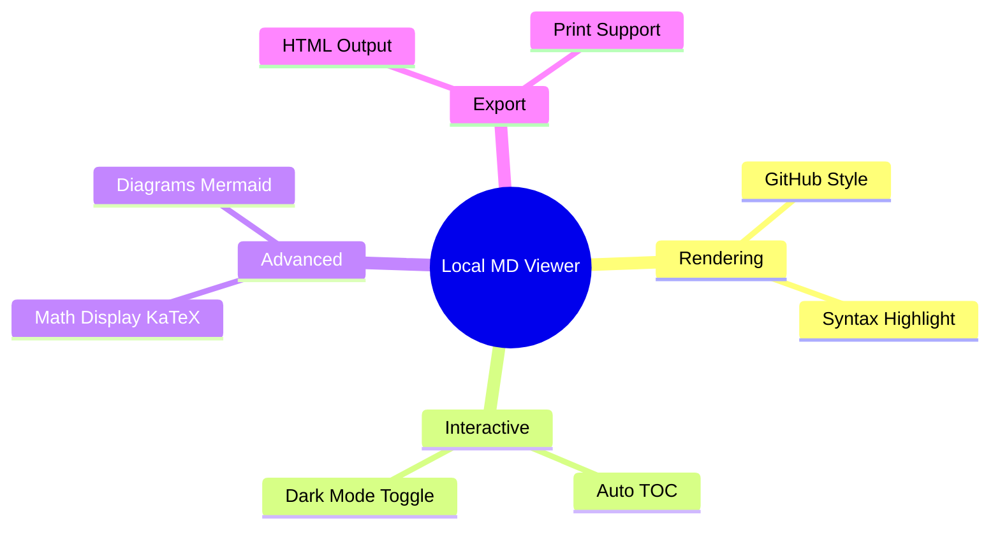

# Local Markdown Viewer - Feature Demo

View local Markdown files beautifully in Chrome.

## Key Features

This Chrome extension dramatically enhances your Markdown experience.

## Interactive Features

### Automatic Table of Contents
Automatically generates a table of contents from headings and displays it in the left sidebar.

### Dark Mode Support
Switch between light and dark modes with a single click.

## Advanced Features

### Math Rendering
Supports beautiful mathematical expressions with KaTeX.

Inline math: $E = mc^2$

Display math:
$$
\int_{-\infty}^{\infty} e^{-x^2} dx = \sqrt{\pi}
$$

### Mermaid Diagrams
Create diagrams like the feature map above with ease.

## Export Features

### HTML Output
Export as a standalone HTML file with all styles and images included.

### Print Optimization
Automatically hides the TOC and buttons during printing to optimize content.

## Other Features

### Security
Prevents XSS attacks with DOMPurify sanitization.

### Multi-language Support
Supports Japanese, English, and Simplified Chinese.

### Customizable
Resize the TOC sidebar width by dragging.
