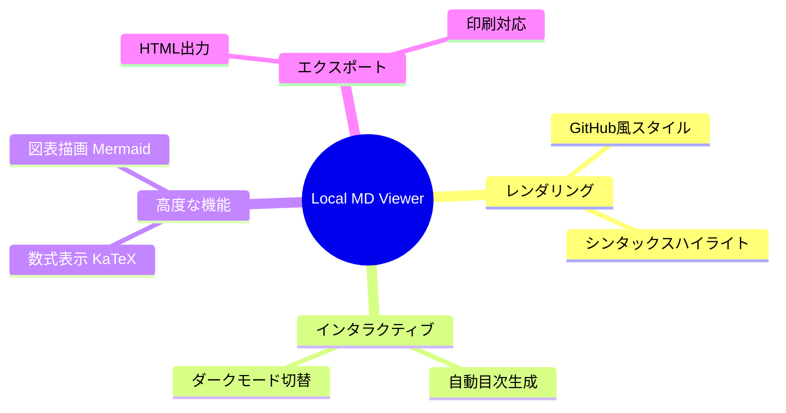

# Local Markdown Viewer - 機能デモ

ChromeでローカルのMarkdownファイルを美しく表示します。

## 主要機能

このChrome拡張機能は、あなたのMarkdown体験を劇的に向上させます。

## インタラクティブ機能

### 自動目次生成
見出しから自動的に目次を生成し、左サイドバーに表示します。

### ダークモード対応
ワンクリックでライト/ダークモードを切り替え可能です。

## 高度な機能

### 数式レンダリング
KaTeXによる美しい数式表示をサポートしています。

インライン数式: $E = mc^2$

ディスプレイ数式:
$$
\int_{-\infty}^{\infty} e^{-x^2} dx = \sqrt{\pi}
$$

### Mermaidダイアグラム
上記の機能マップのような図表を簡単に作成できます。

## エクスポート機能

### HTML出力
すべてのスタイルと画像を含むスタンドアロンHTMLファイルとしてエクスポート可能です。

### 印刷最適化
印刷時は目次やボタンを自動的に非表示にし、コンテンツを最適化します。

## その他の機能

### セキュリティ
DOMPurifyによるサニタイゼーションでXSS攻撃を防止します。

### 多言語対応
日本語、英語、中国語簡体字に対応しています。

### カスタマイズ可能
目次サイドバーの幅をドラッグでリサイズできます。
