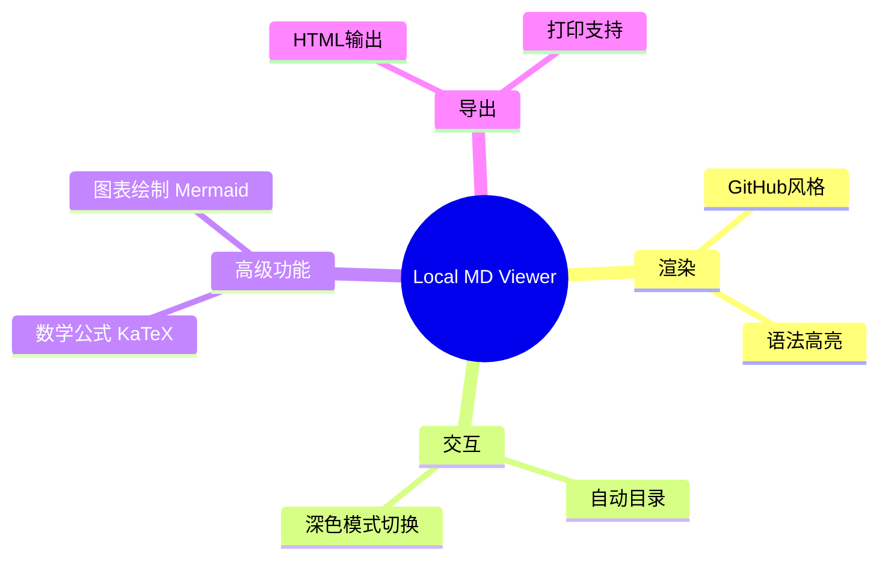

# Local Markdown Viewer - 功能演示

在Chrome中优雅地查看本地Markdown文件。

## 主要功能

这个Chrome扩展程序将极大地提升您的Markdown体验。

## 交互功能

### 自动生成目录
从标题自动生成目录并显示在左侧边栏中。

### 深色模式支持
一键切换浅色/深色模式。

## 高级功能

### 数学公式渲染
使用KaTeX支持优美的数学表达式显示。

行内公式：$E = mc^2$

显示公式：
$$
\int_{-\infty}^{\infty} e^{-x^2} dx = \sqrt{\pi}
$$

### Mermaid图表
轻松创建如上方功能图谱般的图表。

## 导出功能

### HTML输出
导出为包含所有样式和图片的独立HTML文件。

### 打印优化
打印时自动隐藏目录和按钮以优化内容显示。

## 其他功能

### 安全性
通过DOMPurify清理防止XSS攻击。

### 多语言支持
支持日语、英语和简体中文。

### 可自定义
可通过拖动调整目录侧边栏宽度。
