# Mermaid ダイアグラムテスト

このファイルは、Local Markdown ViewerのMermaid対応をテストするためのものです。

## 目次

1. [フローチャート](#フローチャート)
2. [シーケンス図](#シーケンス図)
3. [クラス図](#クラス図)
4. [状態遷移図](#状態遷移図)
5. [ER図](#er図)
6. [ガントチャート](#ガントチャート)
7. [円グラフ](#円グラフ)
8. [通常のコードブロック](#通常のコードブロック)

---

## フローチャート

### 基本的なフローチャート

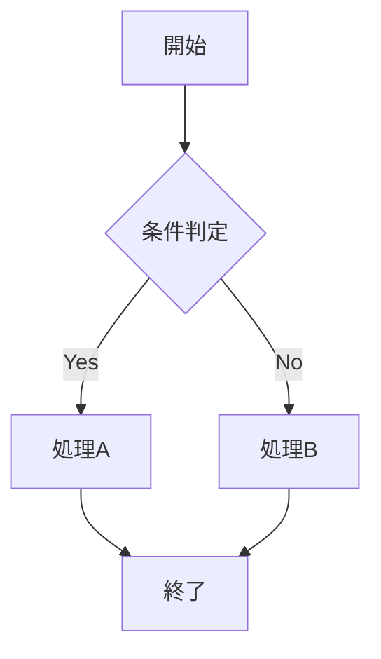

### より複雑なフローチャート

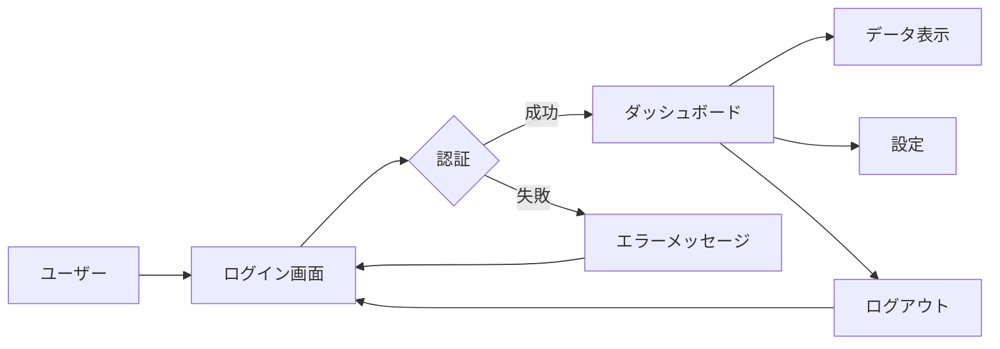

---

## シーケンス図

### ユーザー認証のシーケンス図

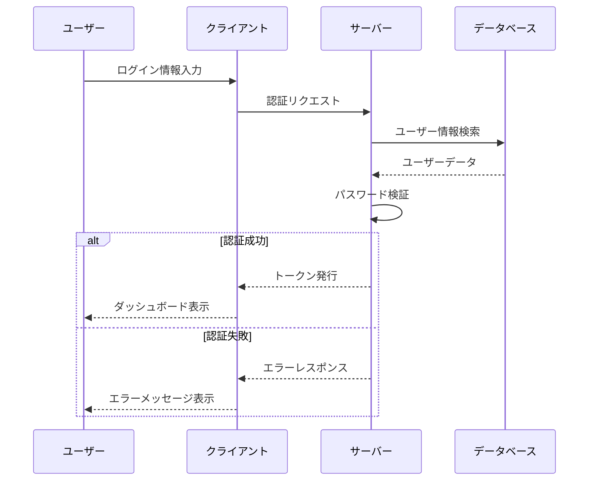

### API呼び出しのシーケンス

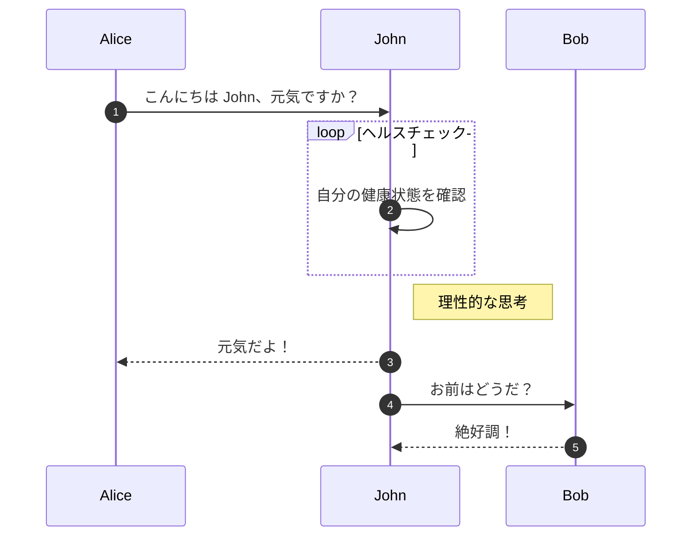

---

## クラス図

### オブジェクト指向設計

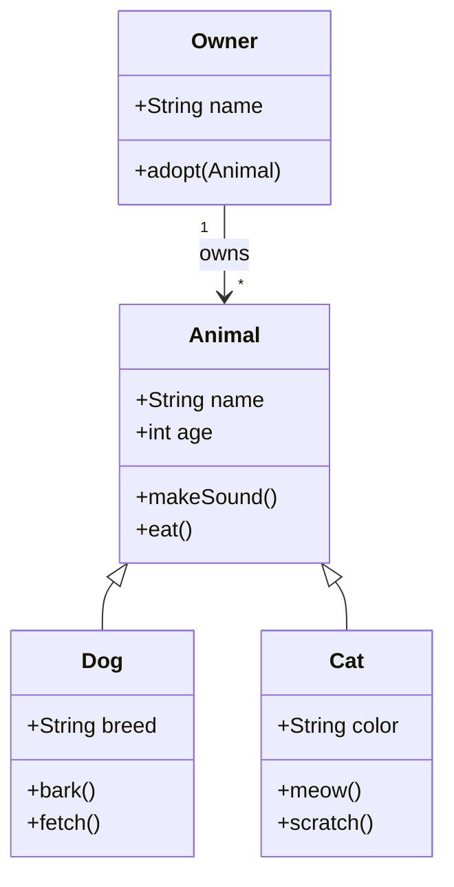

---

## 状態遷移図

### 注文プロセスの状態遷移

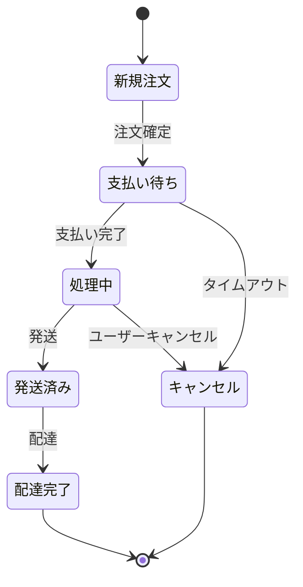

---

## ER図

### データベース設計

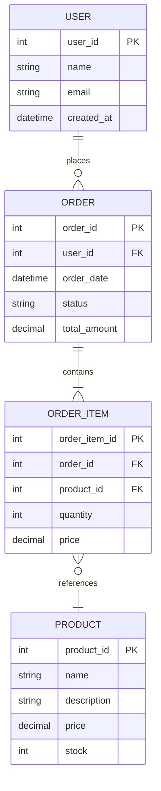

---

## ガントチャート

### プロジェクトスケジュール

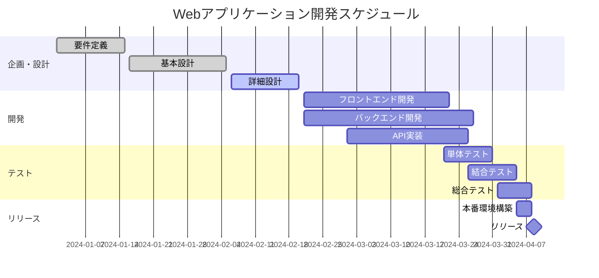

---

## 円グラフ

### プログラミング言語の使用率

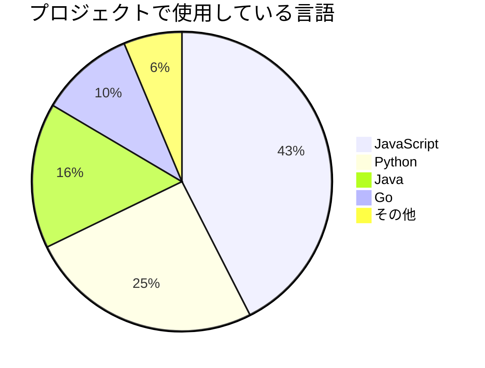

---

## Git グラフ

### ブランチ戦略

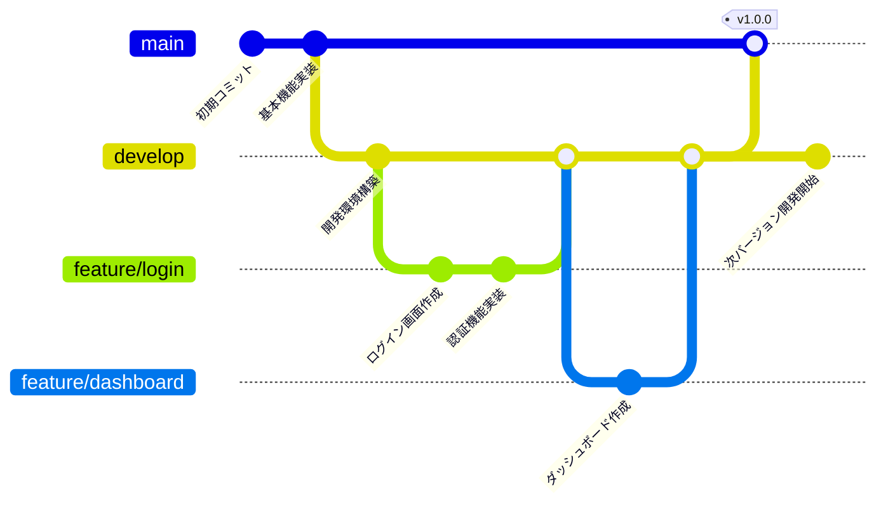

---

## 通常のコードブロック

Mermaid以外の通常のコードブロックも正しく表示されることを確認：

### JavaScript

```javascript
function fibonacci(n) {
  if (n <= 1) return n;
  return fibonacci(n - 1) + fibonacci(n - 2);
}

console.log(fibonacci(10)); // 55
```

### Python

```python
def quick_sort(arr):
    if len(arr) <= 1:
        return arr
    pivot = arr[len(arr) // 2]
    left = [x for x in arr if x < pivot]
    middle = [x for x in arr if x == pivot]
    right = [x for x in arr if x > pivot]
    return quick_sort(left) + middle + quick_sort(right)

print(quick_sort([3, 6, 8, 10, 1, 2, 1]))
```

---

## テスト結果チェックリスト

以下の項目を確認してください：

- [ ] すべてのMermaidダイアグラムが正しく描画される
- [ ] ダイアグラムが中央揃えで表示される
- [ ] ライトモードで背景が白色
- [ ] ダークモードで背景がダークグレー
- [ ] ダークモード切り替え時にページがリロードされる
- [ ] ダークモードでダイアグラムのテーマが変わる
- [ ] 通常のコードブロック（JavaScript、Python）も正しく表示される
- [ ] 通常のコードブロックのシンタックスハイライトが機能する
- [ ] 目次から各セクションへジャンプできる
- [ ] ページがスムーズにスクロールする

---

## 追加テスト: 複数のダイアグラムの混在

### フローチャート + テキスト + シーケンス図

まずはフローチャート：

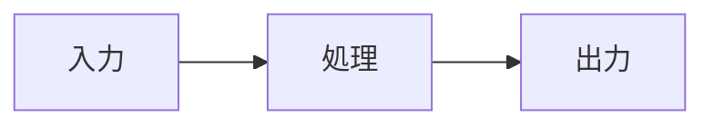

中間にテキストや**太字**、*イタリック*、`コード`などを含めます。

次にシーケンス図：

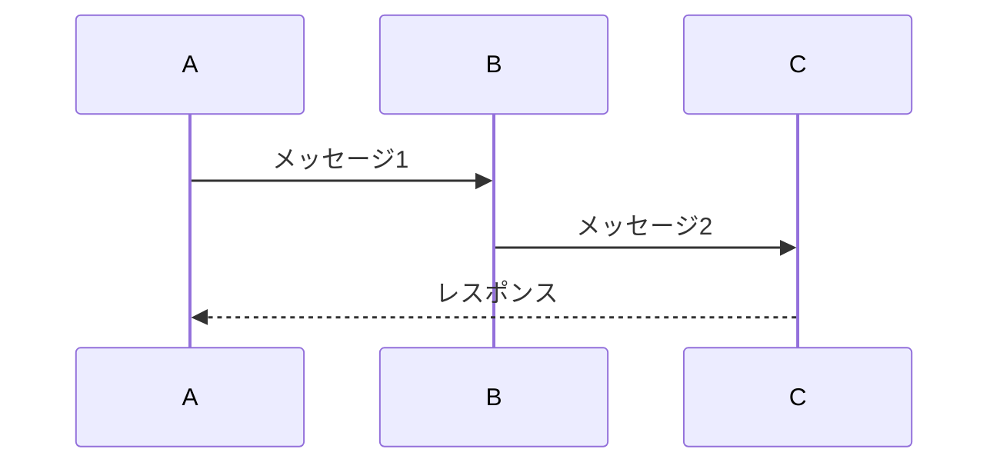

最後に通常のコードブロック：

```go
package main

import "fmt"

func main() {
    fmt.Println("Hello, Mermaid!")
}
```

すべてが正しく表示されることを確認してください！
