# Mermaid ダイアグラムテスト - 色設定パターン網羅版（v11.12.1対応）

このファイルは、Local Markdown ViewerのMermaid対応と色変換機能をテストするためのものです。

## 目次

1. [フローチャート](#フローチャート)
   - デフォルトスタイル（色指定なし）
   - 色設定あり（5色、10色、虹色）
2. [シーケンス図](#シーケンス図)
   - デフォルトスタイル（色指定なし）
   - rect色分けあり
3. [クラス図](#クラス図)
   - デフォルトスタイル（色指定なし）
   - style方式、classDef方式
4. [状態遷移図](#状態遷移図色設定あり)
5. [ガントチャート（done/active/crit）](#ガントチャート)
6. [ER図](#er図)
7. [円グラフ](#円グラフ)
8. [Gitグラフ](#gitグラフ)
9. [色変換テスト用パターン](#色変換テスト用パターン)

---

## フローチャート

### デフォルトスタイル（色指定なし）

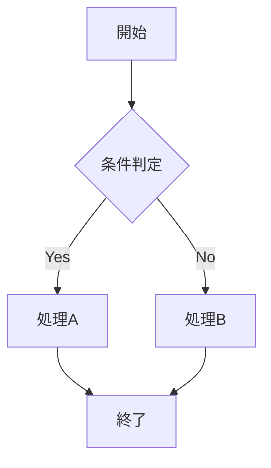

**注**: このフローチャートは色指定なしで、Mermaidのデフォルトテーマカラーが適用されます。

### 基本的なフローチャート（色設定あり）

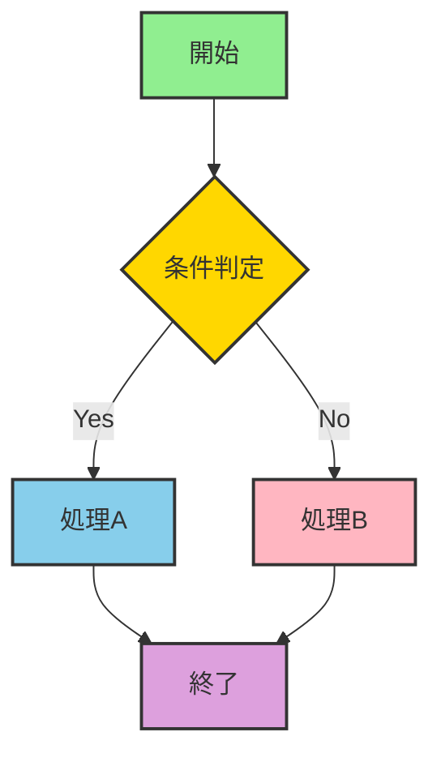

### 複雑なフローチャート（10色パターン）

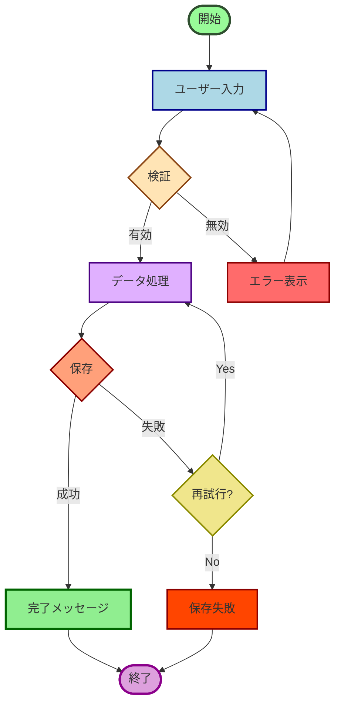

### カラフルなワークフロー（虹色パターン + テキスト色）

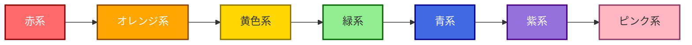

---

## シーケンス図

### デフォルトスタイル（色指定なし）

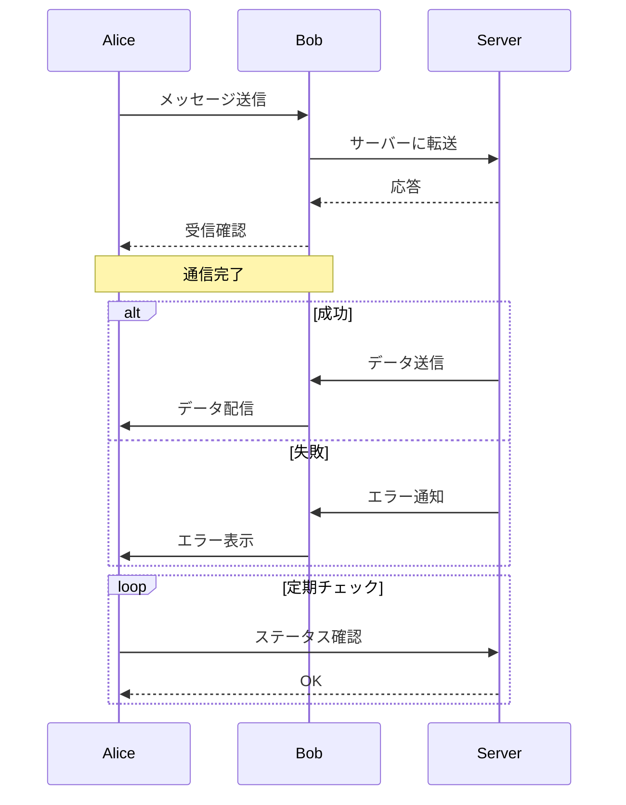

**注**: このシーケンス図は色指定なしで、Mermaidのデフォルトカラーが適用されます。

### カラフルなシーケンス図（rect色分け）

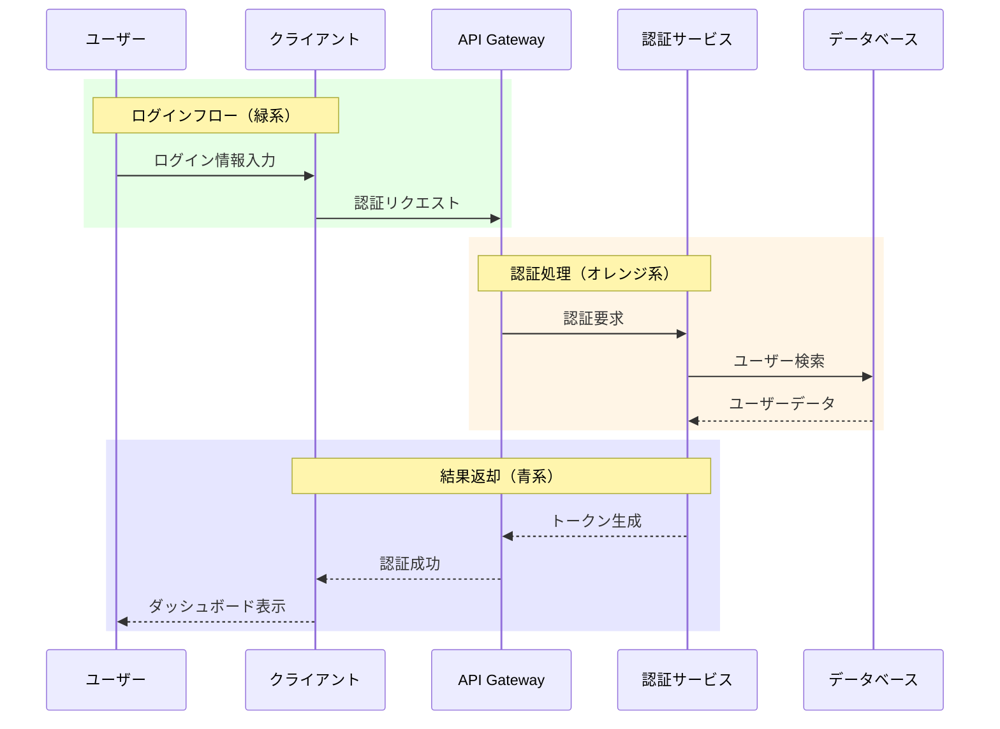

### 条件分岐のあるシーケンス図（複数rect）

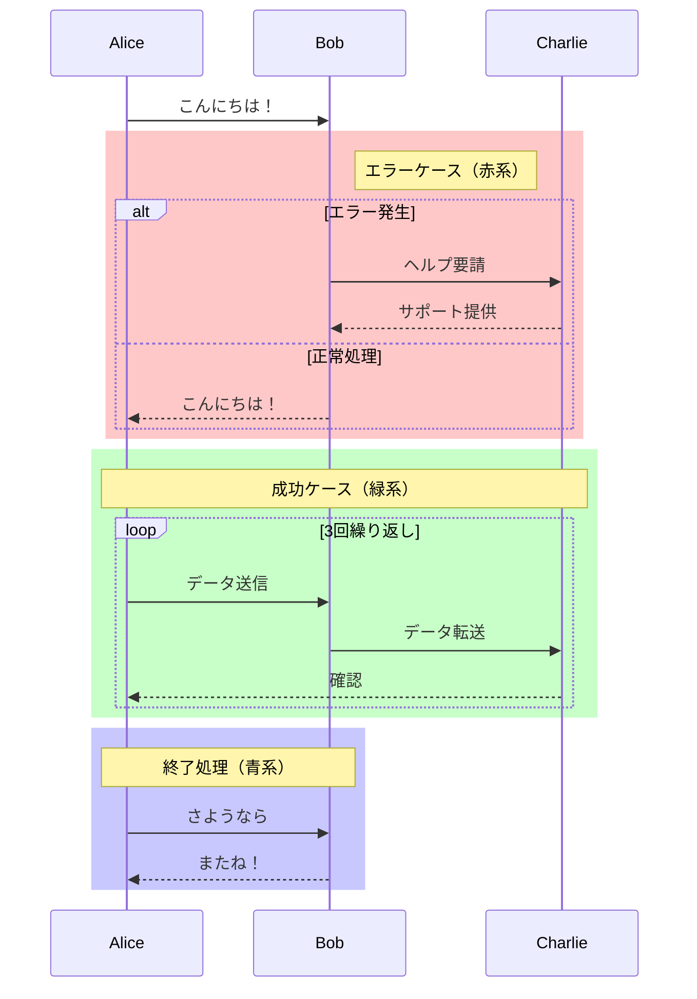

---

## クラス図

### デフォルトスタイル（色指定なし）

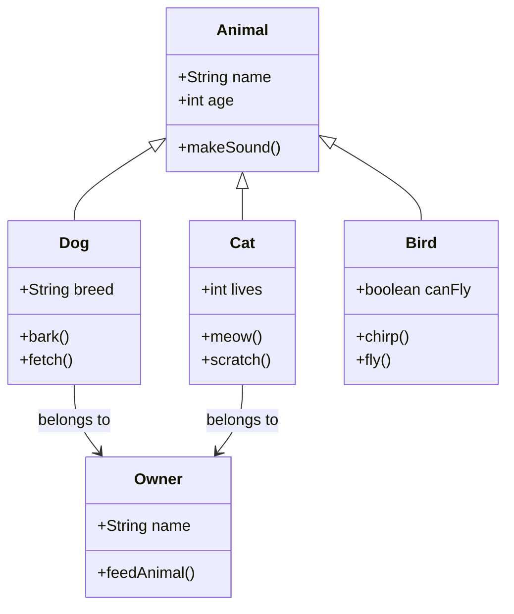

**注**: このクラス図は色指定なしで、Mermaidのデフォルトカラーが適用されます。

### クラス図 - style方式（色設定あり）

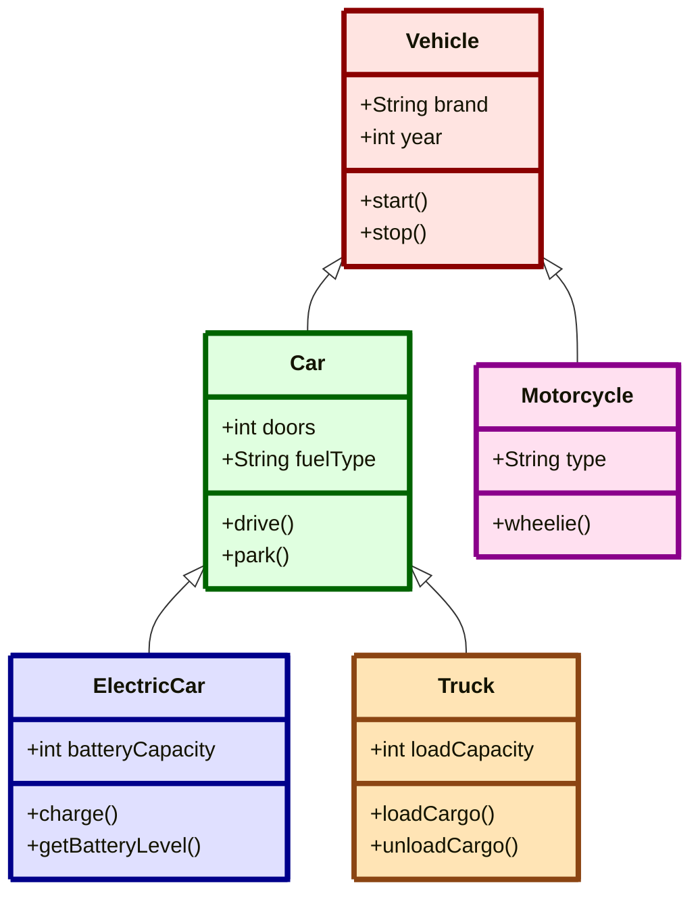

### クラス図 - classDef方式（スタイル再利用）

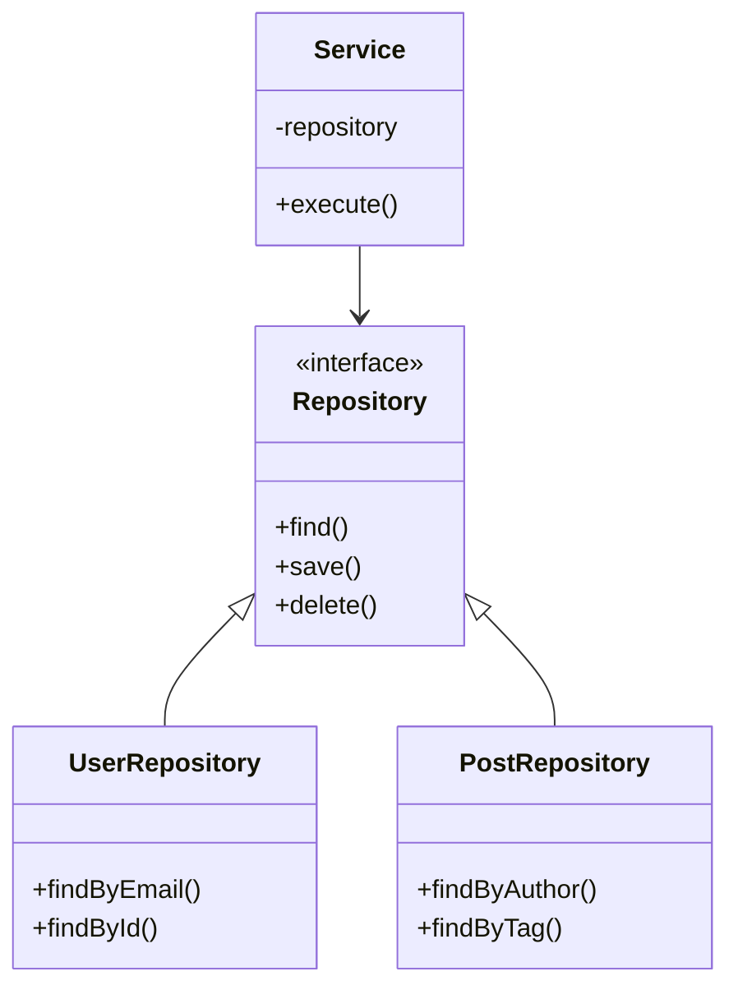

---

## 状態遷移図（色設定あり）

### 状態遷移図（デフォルトテーマカラー）

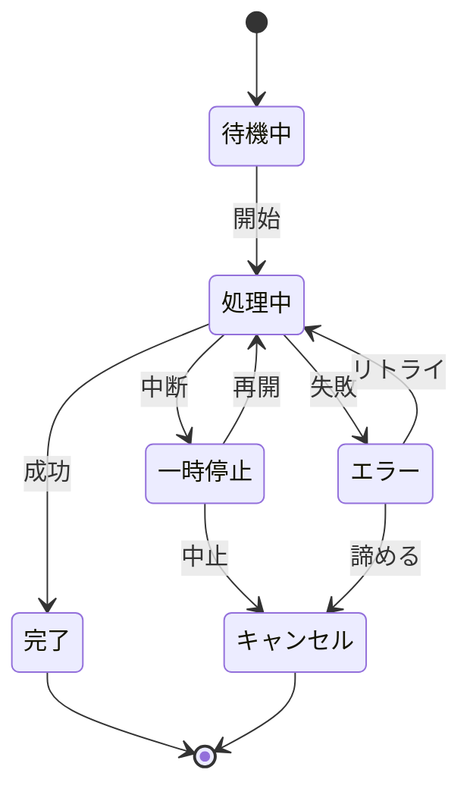

**注**: 状態遷移図（stateDiagram-v2）では、Mermaid v11.12.1でstyleディレクティブがサポートされていないため、テーマのデフォルトカラーを使用します。ダークモード時は自動的にダークテーマの色が適用されます。

### 複雑な状態遷移（ネスト付き）

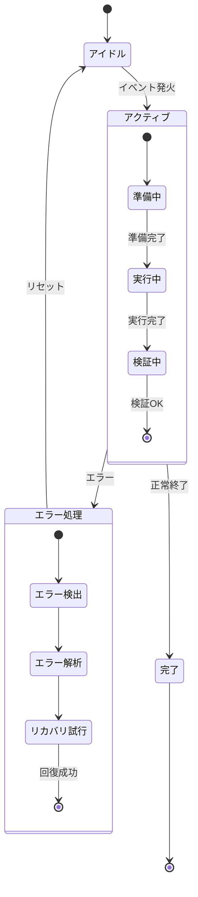

---

## ガントチャート

### プロジェクトスケジュール（done/active/crit網羅）

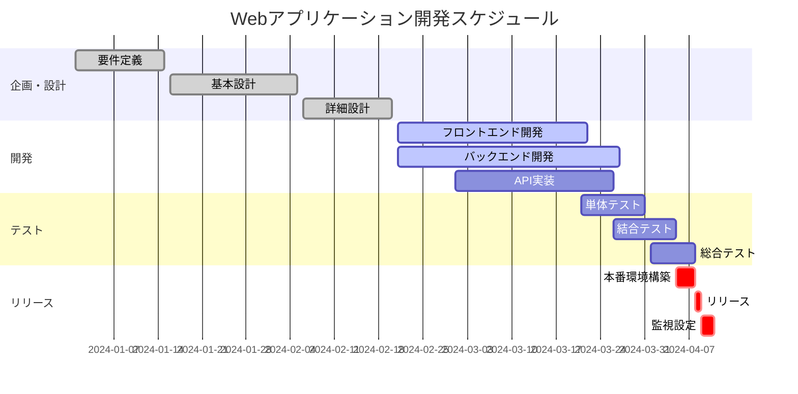

### 複雑なガントチャート（全パターン）

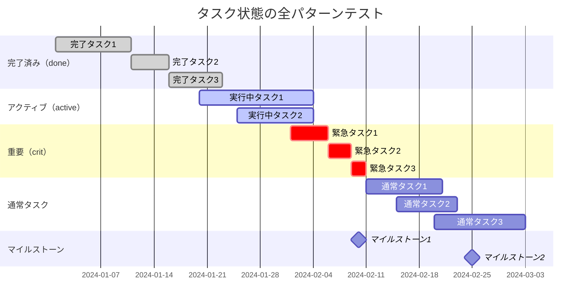

---

## ER図

### データベース設計

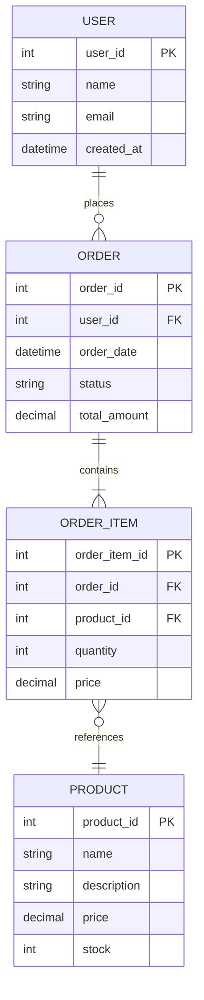

---

## 円グラフ

### プログラミング言語の使用率

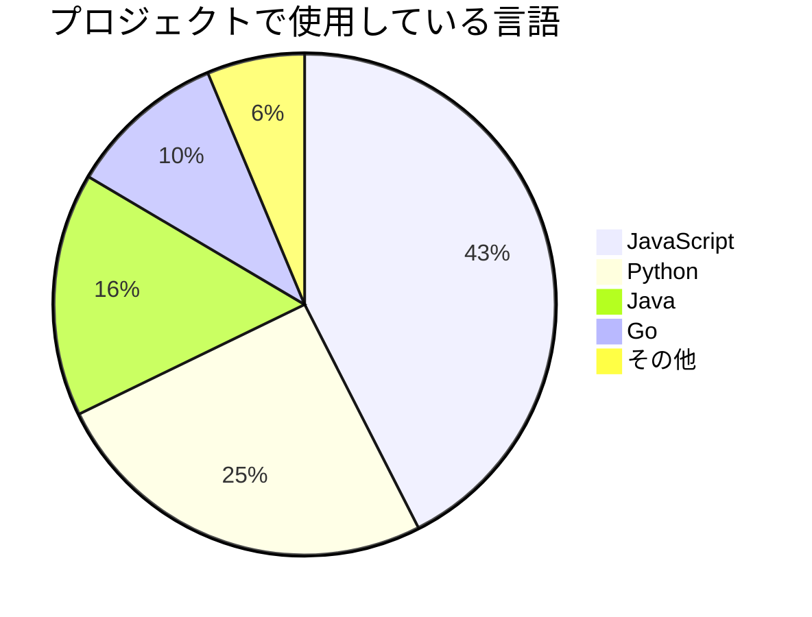

### チーム構成

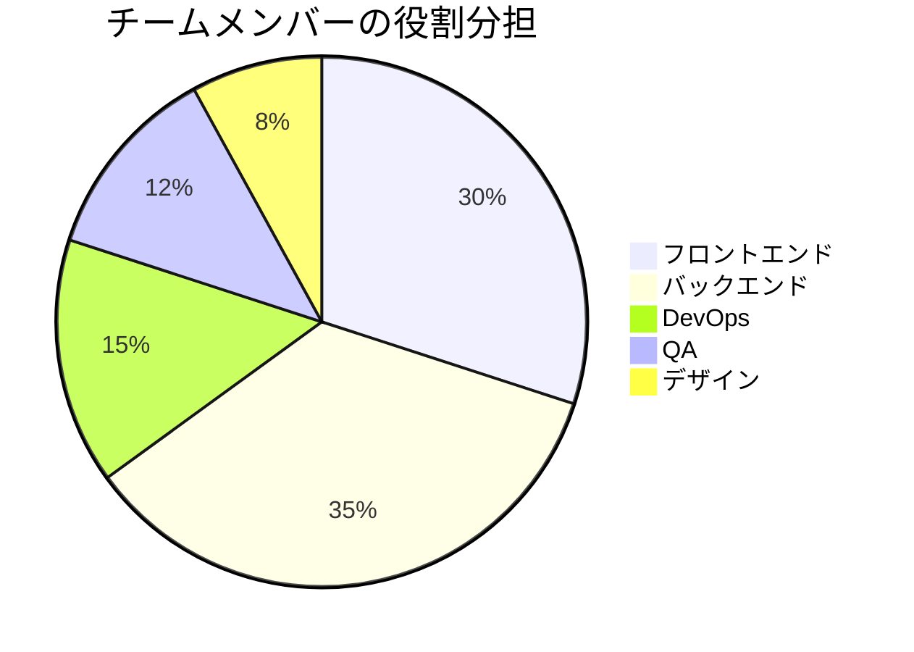

---

## Gitグラフ

### ブランチ戦略

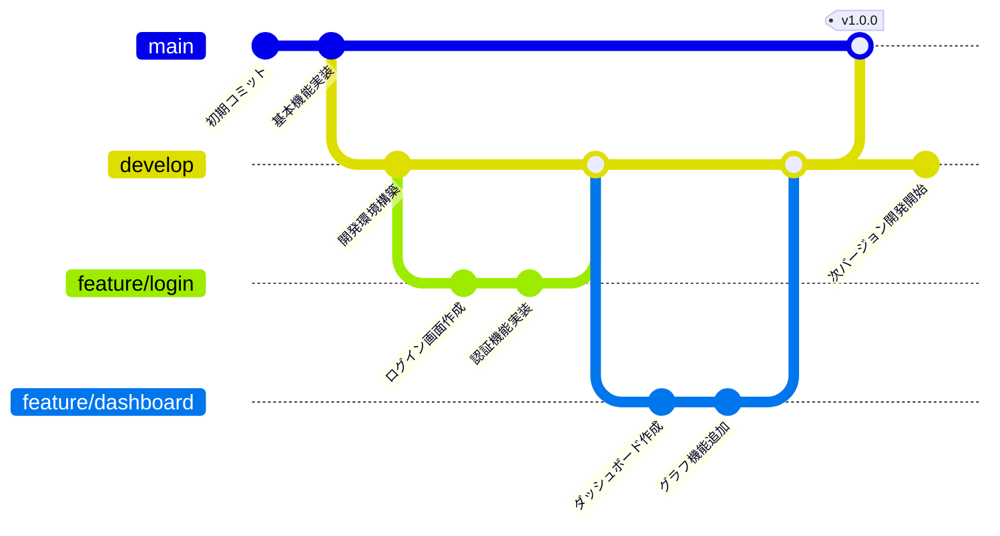

---

## 色変換テスト用パターン

### 明るい色のテスト（パステルカラー）

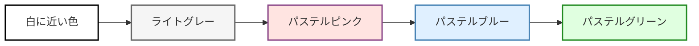

### 暗い色のテスト（ダークカラー + 白文字）


### 中間色のテスト（ミドルトーン）

```mermaid
graph TB
    A[グレー系] --> B[ベージュ系]
    B --> C[オリーブ系]
    C --> D[ティール系]
    D --> E[ラベンダー系]

    style A fill:#808080,stroke:#000,stroke-width:2,color:#fff
    style B fill:#D2B48C,stroke:#8B7355,stroke-width:2
    style C fill:#808000,stroke:#556B2F,stroke-width:2,color:#fff
    style D fill:#008080,stroke:#2F4F4F,stroke-width:2,color:#fff
    style E fill:#9370DB,stroke:#4B0082,stroke-width:2,color:#fff
```

---

## テスト結果チェックリスト

### ライトモードでの確認

- [ ] フローチャート（デフォルトスタイル）がMermaidの標準色で表示される
- [ ] フローチャート（色設定あり）の色が正しく表示される（3種類）
- [ ] シーケンス図（デフォルトスタイル）が標準色で表示される
- [ ] シーケンス図の色付きボックス（rect）が表示される（2種類）
- [ ] クラス図（デフォルトスタイル）が標準色で表示される
- [ ] クラス図の各クラスに色が付いている（style方式、classDef方式）
- [ ] 状態遷移図がテーマカラーで表示される（2種類とも）
- [ ] ガントチャートのdone/active/critタスクが識別できる（2種類とも）
- [ ] 円グラフの色が表示される（2種類とも）
- [ ] Gitグラフが正しく描画される
- [ ] ER図が正しく描画される
- [ ] 色変換テストの3つのフローチャートが表示される
- [ ] すべてのダイアグラムにエラーが出ない

### ダークモードでの確認

**注意**: すべてのMermaidダイアグラムは常にライトテーマ（白背景）で表示されます。

- [ ] すべてのダイアグラムが白背景で表示される
- [ ] フローチャート（デフォルトスタイル）が見やすい
- [ ] フローチャート（色設定あり）の色が正しく表示される
- [ ] シーケンス図（デフォルトスタイル）が見やすい
- [ ] シーケンス図の色付きボックス（rect）が表示される
- [ ] クラス図（デフォルトスタイル）が見やすい
- [ ] クラス図の色が適切に表示される（style方式、classDef方式）
- [ ] 状態遷移図が見やすい
- [ ] ガントチャートのdone/active/critタスクが識別できる
- [ ] すべてのテキストが読みやすい
- [ ] Gitグラフ、ER図、円グラフが見やすい
- [ ] ダイアグラム周辺のMarkdownコンテンツはダークモードになっている

### 機能確認

- [ ] ダークモード切り替え時にページがリロードされる
- [ ] すべてのダイアグラムが正しく描画される（エラーなし）
- [ ] 目次から各セクションへジャンプできる
- [ ] 印刷機能が正常に動作する

---

すべてのパターンが正しく動作することを確認してください！
