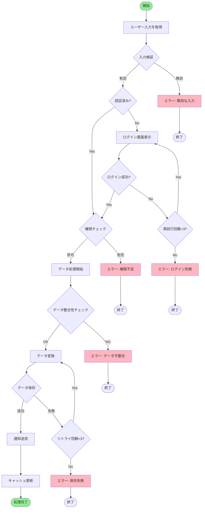
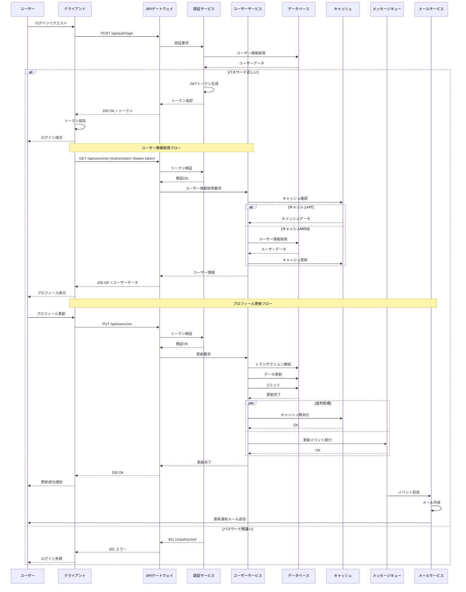
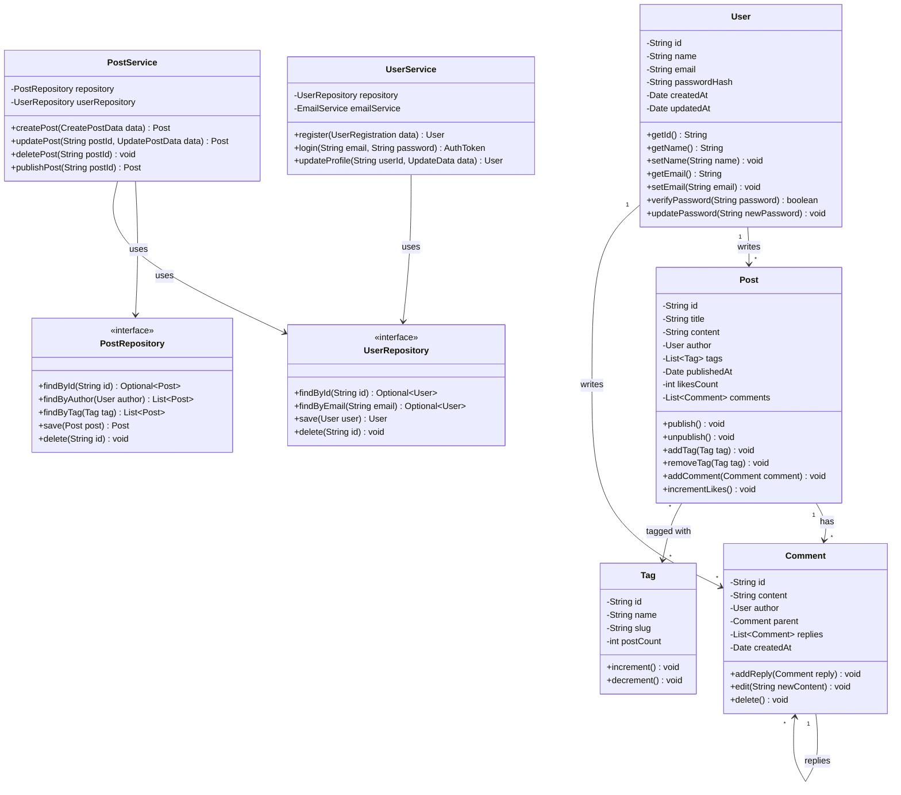
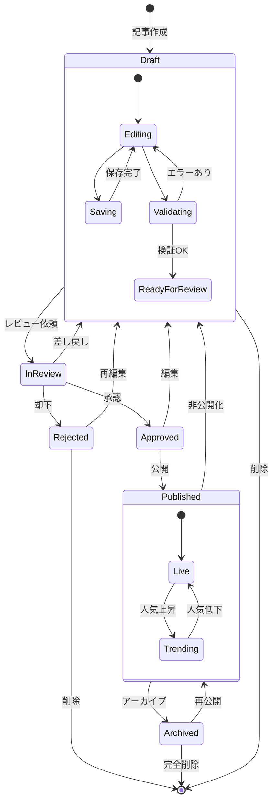
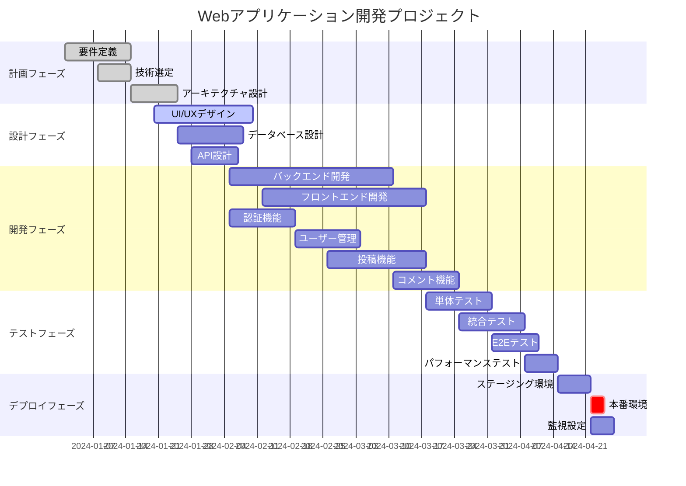
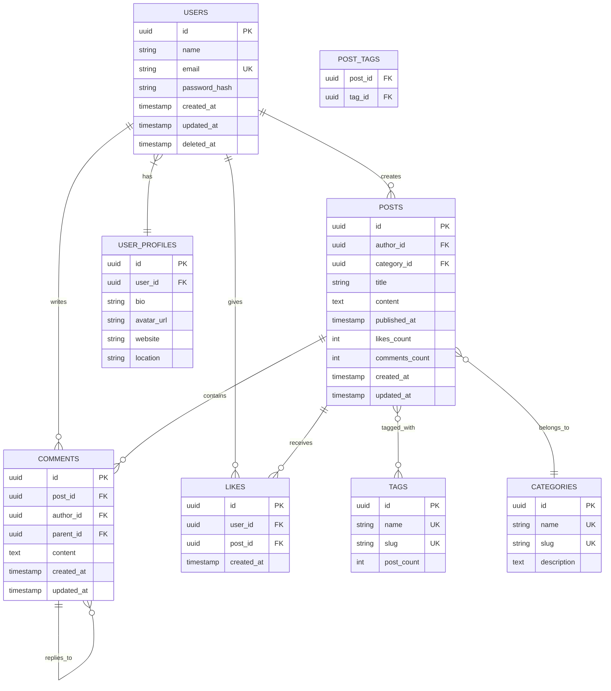
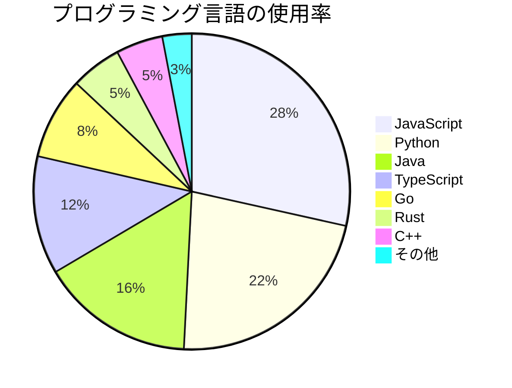
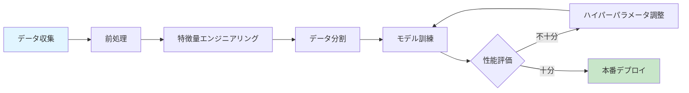
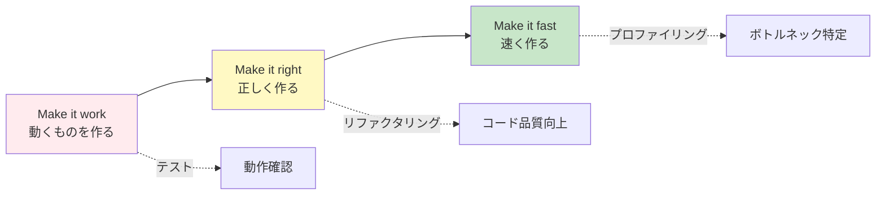

# 総合機能テスト - 重負荷版

このファイルはLocal Markdown Viewerのすべての機能を網羅し、パフォーマンステストを行うための巨大なテストファイルです。

## 目次

このファイルには以下のセクションが含まれています：

1. GitHub Flavored Markdown機能
2. 大量のシンタックスハイライト
3. 複雑なMermaidダイアグラム
4. 大量のKaTeX数式
5. 複合コンテンツ

---

# 1. GitHub Flavored Markdown機能

## 1.1 テーブル機能

### 基本的なテーブル

| 番号 | 名前 | 年齢 | 職業 | 居住地 | メールアドレス |
|------|------|------|------|--------|----------------|
| 1 | 山田太郎 | 25 | エンジニア | 東京都 | yamada@example.com |
| 2 | 佐藤花子 | 30 | デザイナー | 大阪府 | sato@example.com |
| 3 | 鈴木一郎 | 28 | プロダクトマネージャー | 福岡県 | suzuki@example.com |
| 4 | 田中美咲 | 32 | データサイエンティスト | 北海道 | tanaka@example.com |
| 5 | 伊藤健太 | 27 | フロントエンドエンジニア | 愛知県 | ito@example.com |

### 複雑なテーブル

| プログラミング言語 | パラダイム | 型システム | 主な用途 | 人気度 | リリース年 |
|-------------------|-----------|-----------|---------|--------|-----------|
| JavaScript | マルチパラダイム | 動的型付け | Web開発、サーバーサイド | ⭐⭐⭐⭐⭐ | 1995 |
| Python | マルチパラダイム | 動的型付け | AI/ML、Web、データ分析 | ⭐⭐⭐⭐⭐ | 1991 |
| Java | オブジェクト指向 | 静的型付け | エンタープライズ、Android | ⭐⭐⭐⭐ | 1995 |
| Go | 手続き型 | 静的型付け | バックエンド、CLI | ⭐⭐⭐⭐ | 2009 |
| Rust | マルチパラダイム | 静的型付け | システム、パフォーマンス | ⭐⭐⭐ | 2010 |
| TypeScript | マルチパラダイム | 静的型付け | Web開発 | ⭐⭐⭐⭐⭐ | 2012 |
| C++ | マルチパラダイム | 静的型付け | ゲーム、システム | ⭐⭐⭐⭐ | 1985 |
| C# | オブジェクト指向 | 静的型付け | Windows、Unity | ⭐⭐⭐⭐ | 2000 |

## 1.2 タスクリスト

### プロジェクト管理タスク

- [x] プロジェクト初期化
- [x] 要件定義
- [x] 技術選定
- [x] アーキテクチャ設計
- [ ] UI/UXデザイン
  - [x] ワイヤーフレーム作成
  - [x] モックアップ作成
  - [ ] ユーザビリティテスト
- [ ] 開発
  - [x] バックエンド開発
  - [ ] フロントエンド開発
    - [x] コンポーネント設計
    - [ ] 実装
    - [ ] テスト
  - [ ] データベース設計
- [ ] テスト
  - [ ] 単体テスト
  - [ ] 統合テスト
  - [ ] E2Eテスト
- [ ] デプロイ
- [ ] ドキュメント作成

### 日常タスク

- [x] ~~買い物に行く~~
- [x] ~~メールを返信する~~
- [ ] レポートを書く
- [ ] プレゼン資料を準備する
- [x] ~~会議に参加する~~

## 1.3 打ち消し線とその他の装飾

これは**太字**のテキストです。これは*斜体*のテキストです。これは***太字斜体***のテキストです。

~~これは間違った情報です~~。これが正しい情報です。

~~$100~~ → **$80** (20%オフ!)

`インラインコード`を使用できます。

---

# 2. 大量のシンタックスハイライト

## 2.1 JavaScript/TypeScript

### React コンポーネント

```javascript
import React, { useState, useEffect, useCallback } from 'react';
import PropTypes from 'prop-types';

const UserDashboard = ({ userId, onUpdate }) => {
  const [user, setUser] = useState(null);
  const [loading, setLoading] = useState(true);
  const [error, setError] = useState(null);

  useEffect(() => {
    const fetchUser = async () => {
      try {
        setLoading(true);
        const response = await fetch(`/api/users/${userId}`);
        if (!response.ok) {
          throw new Error('Failed to fetch user');
        }
        const data = await response.json();
        setUser(data);
      } catch (err) {
        setError(err.message);
      } finally {
        setLoading(false);
      }
    };

    fetchUser();
  }, [userId]);

  const handleUpdate = useCallback((updates) => {
    setUser(prev => ({ ...prev, ...updates }));
    onUpdate?.(updates);
  }, [onUpdate]);

  if (loading) return <div>Loading...</div>;
  if (error) return <div>Error: {error}</div>;
  if (!user) return null;

  return (
    <div className="user-dashboard">
      <h1>Welcome, {user.name}!</h1>
      <div className="user-stats">
        <StatCard title="Posts" value={user.postCount} />
        <StatCard title="Followers" value={user.followerCount} />
        <StatCard title="Following" value={user.followingCount} />
      </div>
    </div>
  );
};

UserDashboard.propTypes = {
  userId: PropTypes.string.isRequired,
  onUpdate: PropTypes.func
};

export default UserDashboard;
```

### TypeScript インターフェース

```typescript
interface User {
  id: string;
  name: string;
  email: string;
  age: number;
  createdAt: Date;
  updatedAt: Date;
}

interface Post {
  id: string;
  title: string;
  content: string;
  author: User;
  tags: string[];
  publishedAt: Date | null;
  likes: number;
  comments: Comment[];
}

interface Comment {
  id: string;
  content: string;
  author: User;
  createdAt: Date;
  replies: Comment[];
}

type ApiResponse<T> = {
  data: T;
  status: 'success' | 'error';
  message?: string;
};

async function fetchUser(userId: string): Promise<ApiResponse<User>> {
  try {
    const response = await fetch(`/api/users/${userId}`);
    const data = await response.json();
    return {
      data,
      status: 'success'
    };
  } catch (error) {
    return {
      data: null as any,
      status: 'error',
      message: error instanceof Error ? error.message : 'Unknown error'
    };
  }
}
```

## 2.2 Python

### データ分析とML

```python
import numpy as np
import pandas as pd
from sklearn.model_selection import train_test_split
from sklearn.ensemble import RandomForestClassifier
from sklearn.metrics import accuracy_score, classification_report
import matplotlib.pyplot as plt
import seaborn as sns

class DataAnalyzer:
    def __init__(self, data_path):
        self.data_path = data_path
        self.df = None
        self.model = None

    def load_data(self):
        """データを読み込む"""
        self.df = pd.read_csv(self.data_path)
        print(f"Loaded {len(self.df)} records")
        return self

    def preprocess(self):
        """データの前処理"""
        # 欠損値を削除
        self.df = self.df.dropna()

        # カテゴリカル変数をエンコード
        categorical_cols = self.df.select_dtypes(include=['object']).columns
        self.df = pd.get_dummies(self.df, columns=categorical_cols)

        return self

    def visualize(self):
        """データを可視化"""
        fig, axes = plt.subplots(2, 2, figsize=(12, 10))

        # ヒストグラム
        self.df.hist(ax=axes[0, 0])
        axes[0, 0].set_title('Distribution')

        # 相関行列
        sns.heatmap(self.df.corr(), ax=axes[0, 1], cmap='coolwarm')
        axes[0, 1].set_title('Correlation Matrix')

        # 箱ひげ図
        self.df.boxplot(ax=axes[1, 0])
        axes[1, 0].set_title('Box Plot')

        plt.tight_layout()
        plt.show()

        return self

    def train_model(self, target_column, test_size=0.2, random_state=42):
        """モデルを訓練"""
        X = self.df.drop(columns=[target_column])
        y = self.df[target_column]

        X_train, X_test, y_train, y_test = train_test_split(
            X, y, test_size=test_size, random_state=random_state
        )

        self.model = RandomForestClassifier(n_estimators=100, random_state=random_state)
        self.model.fit(X_train, y_train)

        y_pred = self.model.predict(X_test)
        accuracy = accuracy_score(y_test, y_pred)

        print(f"Accuracy: {accuracy:.4f}")
        print("\nClassification Report:")
        print(classification_report(y_test, y_pred))

        return self

    def predict(self, new_data):
        """新しいデータで予測"""
        if self.model is None:
            raise ValueError("Model has not been trained yet")

        return self.model.predict(new_data)

# 使用例
if __name__ == "__main__":
    analyzer = DataAnalyzer('data.csv')
    analyzer.load_data().preprocess().visualize().train_model('target')
```

## 2.3 Java

```java
import java.util.*;
import java.util.stream.*;
import java.util.concurrent.*;

public class UserService {
    private final UserRepository userRepository;
    private final EmailService emailService;
    private final ExecutorService executorService;
    private final Map<String, User> cache;

    public UserService(UserRepository userRepository, EmailService emailService) {
        this.userRepository = userRepository;
        this.emailService = emailService;
        this.executorService = Executors.newFixedThreadPool(10);
        this.cache = new ConcurrentHashMap<>();
    }

    public Optional<User> findUserById(String userId) {
        // キャッシュをチェック
        if (cache.containsKey(userId)) {
            return Optional.of(cache.get(userId));
        }

        // データベースから取得
        Optional<User> user = userRepository.findById(userId);
        user.ifPresent(u -> cache.put(userId, u));

        return user;
    }

    public List<User> findActiveUsers() {
        return userRepository.findAll()
            .stream()
            .filter(User::isActive)
            .sorted(Comparator.comparing(User::getCreatedAt).reversed())
            .collect(Collectors.toList());
    }

    public CompletableFuture<User> createUserAsync(UserCreateRequest request) {
        return CompletableFuture.supplyAsync(() -> {
            // ユーザーを作成
            User user = new User();
            user.setId(UUID.randomUUID().toString());
            user.setName(request.getName());
            user.setEmail(request.getEmail());
            user.setCreatedAt(new Date());

            // データベースに保存
            User savedUser = userRepository.save(user);

            // キャッシュに追加
            cache.put(savedUser.getId(), savedUser);

            return savedUser;
        }, executorService).thenApply(user -> {
            // ウェルカムメールを送信
            emailService.sendWelcomeEmail(user);
            return user;
        });
    }

    public void shutdown() {
        executorService.shutdown();
        try {
            if (!executorService.awaitTermination(60, TimeUnit.SECONDS)) {
                executorService.shutdownNow();
            }
        } catch (InterruptedException e) {
            executorService.shutdownNow();
            Thread.currentThread().interrupt();
        }
    }
}

class User {
    private String id;
    private String name;
    private String email;
    private boolean active;
    private Date createdAt;

    // Getters and Setters
    public String getId() { return id; }
    public void setId(String id) { this.id = id; }
    public String getName() { return name; }
    public void setName(String name) { this.name = name; }
    public String getEmail() { return email; }
    public void setEmail(String email) { this.email = email; }
    public boolean isActive() { return active; }
    public void setActive(boolean active) { this.active = active; }
    public Date getCreatedAt() { return createdAt; }
    public void setCreatedAt(Date createdAt) { this.createdAt = createdAt; }
}
```

## 2.4 Go

```go
package main

import (
    "context"
    "database/sql"
    "encoding/json"
    "fmt"
    "log"
    "net/http"
    "time"

    "github.com/gorilla/mux"
    _ "github.com/lib/pq"
)

type User struct {
    ID        string    `json:"id"`
    Name      string    `json:"name"`
    Email     string    `json:"email"`
    CreatedAt time.Time `json:"created_at"`
}

type UserService struct {
    db *sql.DB
}

func NewUserService(db *sql.DB) *UserService {
    return &UserService{db: db}
}

func (s *UserService) GetUser(ctx context.Context, id string) (*User, error) {
    query := `SELECT id, name, email, created_at FROM users WHERE id = $1`

    var user User
    err := s.db.QueryRowContext(ctx, query, id).Scan(
        &user.ID,
        &user.Name,
        &user.Email,
        &user.CreatedAt,
    )

    if err == sql.ErrNoRows {
        return nil, fmt.Errorf("user not found: %s", id)
    }
    if err != nil {
        return nil, fmt.Errorf("failed to query user: %w", err)
    }

    return &user, nil
}

func (s *UserService) CreateUser(ctx context.Context, name, email string) (*User, error) {
    query := `
        INSERT INTO users (name, email, created_at)
        VALUES ($1, $2, $3)
        RETURNING id, name, email, created_at
    `

    var user User
    err := s.db.QueryRowContext(ctx, query, name, email, time.Now()).Scan(
        &user.ID,
        &user.Name,
        &user.Email,
        &user.CreatedAt,
    )

    if err != nil {
        return nil, fmt.Errorf("failed to create user: %w", err)
    }

    return &user, nil
}

type UserHandler struct {
    service *UserService
}

func NewUserHandler(service *UserService) *UserHandler {
    return &UserHandler{service: service}
}

func (h *UserHandler) GetUser(w http.ResponseWriter, r *http.Request) {
    vars := mux.Vars(r)
    id := vars["id"]

    ctx, cancel := context.WithTimeout(r.Context(), 5*time.Second)
    defer cancel()

    user, err := h.service.GetUser(ctx, id)
    if err != nil {
        http.Error(w, err.Error(), http.StatusNotFound)
        return
    }

    w.Header().Set("Content-Type", "application/json")
    json.NewEncoder(w).Encode(user)
}

func main() {
    db, err := sql.Open("postgres", "postgres://localhost/mydb?sslmode=disable")
    if err != nil {
        log.Fatal(err)
    }
    defer db.Close()

    service := NewUserService(db)
    handler := NewUserHandler(service)

    r := mux.NewRouter()
    r.HandleFunc("/users/{id}", handler.GetUser).Methods("GET")

    srv := &http.Server{
        Handler:      r,
        Addr:         "127.0.0.1:8080",
        WriteTimeout: 15 * time.Second,
        ReadTimeout:  15 * time.Second,
    }

    log.Printf("Server starting on %s", srv.Addr)
    log.Fatal(srv.ListenAndServe())
}
```

## 2.5 Rust

```rust
use std::collections::HashMap;
use std::sync::{Arc, Mutex};
use tokio::time::{sleep, Duration};
use serde::{Deserialize, Serialize};

#[derive(Debug, Clone, Serialize, Deserialize)]
struct User {
    id: String,
    name: String,
    email: String,
    age: u32,
}

#[derive(Clone)]
struct UserRepository {
    storage: Arc<Mutex<HashMap<String, User>>>,
}

impl UserRepository {
    fn new() -> Self {
        UserRepository {
            storage: Arc::new(Mutex::new(HashMap::new())),
        }
    }

    fn create(&self, user: User) -> Result<User, String> {
        let mut storage = self.storage.lock().unwrap();

        if storage.contains_key(&user.id) {
            return Err(format!("User with id {} already exists", user.id));
        }

        storage.insert(user.id.clone(), user.clone());
        Ok(user)
    }

    fn find_by_id(&self, id: &str) -> Option<User> {
        let storage = self.storage.lock().unwrap();
        storage.get(id).cloned()
    }

    fn find_all(&self) -> Vec<User> {
        let storage = self.storage.lock().unwrap();
        storage.values().cloned().collect()
    }

    fn update(&self, id: &str, user: User) -> Result<User, String> {
        let mut storage = self.storage.lock().unwrap();

        if !storage.contains_key(id) {
            return Err(format!("User with id {} not found", id));
        }

        storage.insert(id.to_string(), user.clone());
        Ok(user)
    }

    fn delete(&self, id: &str) -> Result<(), String> {
        let mut storage = self.storage.lock().unwrap();

        if storage.remove(id).is_none() {
            return Err(format!("User with id {} not found", id));
        }

        Ok(())
    }
}

#[tokio::main]
async fn main() {
    let repo = UserRepository::new();

    // ユーザーを作成
    let user1 = User {
        id: "1".to_string(),
        name: "Alice".to_string(),
        email: "alice@example.com".to_string(),
        age: 30,
    };

    match repo.create(user1) {
        Ok(user) => println!("Created user: {:?}", user),
        Err(e) => eprintln!("Error: {}", e),
    }

    // 非同期処理
    sleep(Duration::from_secs(1)).await;

    // すべてのユーザーを取得
    let users = repo.find_all();
    println!("All users: {:?}", users);
}
```

## 2.6 SQL

```sql
-- ユーザーテーブルの作成
CREATE TABLE users (
    id UUID PRIMARY KEY DEFAULT gen_random_uuid(),
    name VARCHAR(255) NOT NULL,
    email VARCHAR(255) UNIQUE NOT NULL,
    password_hash VARCHAR(255) NOT NULL,
    age INTEGER CHECK (age >= 0 AND age <= 150),
    created_at TIMESTAMP DEFAULT CURRENT_TIMESTAMP,
    updated_at TIMESTAMP DEFAULT CURRENT_TIMESTAMP,
    deleted_at TIMESTAMP
);

-- 投稿テーブルの作成
CREATE TABLE posts (
    id UUID PRIMARY KEY DEFAULT gen_random_uuid(),
    user_id UUID NOT NULL REFERENCES users(id) ON DELETE CASCADE,
    title VARCHAR(500) NOT NULL,
    content TEXT,
    published_at TIMESTAMP,
    likes_count INTEGER DEFAULT 0,
    created_at TIMESTAMP DEFAULT CURRENT_TIMESTAMP,
    updated_at TIMESTAMP DEFAULT CURRENT_TIMESTAMP
);

-- コメントテーブルの作成
CREATE TABLE comments (
    id UUID PRIMARY KEY DEFAULT gen_random_uuid(),
    post_id UUID NOT NULL REFERENCES posts(id) ON DELETE CASCADE,
    user_id UUID NOT NULL REFERENCES users(id) ON DELETE CASCADE,
    parent_id UUID REFERENCES comments(id) ON DELETE CASCADE,
    content TEXT NOT NULL,
    created_at TIMESTAMP DEFAULT CURRENT_TIMESTAMP,
    updated_at TIMESTAMP DEFAULT CURRENT_TIMESTAMP
);

-- インデックスの作成
CREATE INDEX idx_posts_user_id ON posts(user_id);
CREATE INDEX idx_posts_published_at ON posts(published_at);
CREATE INDEX idx_comments_post_id ON comments(post_id);
CREATE INDEX idx_comments_user_id ON comments(user_id);

-- 複雑なクエリ: ユーザーごとの投稿数とコメント数を取得
WITH user_stats AS (
    SELECT
        u.id,
        u.name,
        u.email,
        COUNT(DISTINCT p.id) as post_count,
        COUNT(DISTINCT c.id) as comment_count
    FROM users u
    LEFT JOIN posts p ON u.id = p.user_id AND p.deleted_at IS NULL
    LEFT JOIN comments c ON u.id = c.user_id
    WHERE u.deleted_at IS NULL
    GROUP BY u.id, u.name, u.email
)
SELECT
    us.*,
    RANK() OVER (ORDER BY us.post_count DESC) as post_rank,
    RANK() OVER (ORDER BY us.comment_count DESC) as comment_rank
FROM user_stats us
ORDER BY us.post_count DESC, us.comment_count DESC
LIMIT 100;

-- トリガーの作成: updated_atを自動更新
CREATE OR REPLACE FUNCTION update_updated_at_column()
RETURNS TRIGGER AS $$
BEGIN
    NEW.updated_at = CURRENT_TIMESTAMP;
    RETURN NEW;
END;
$$ language 'plpgsql';

CREATE TRIGGER update_users_updated_at BEFORE UPDATE ON users
    FOR EACH ROW EXECUTE FUNCTION update_updated_at_column();

CREATE TRIGGER update_posts_updated_at BEFORE UPDATE ON posts
    FOR EACH ROW EXECUTE FUNCTION update_updated_at_column();

CREATE TRIGGER update_comments_updated_at BEFORE UPDATE ON comments
    FOR EACH ROW EXECUTE FUNCTION update_updated_at_column();
```

---

# 3. 複雑なMermaidダイアグラム

## 3.1 フローチャート（複雑版）



## 3.2 シーケンス図（複雑版）



## 3.3 クラス図



## 3.4 状態遷移図



## 3.5 ガントチャート



## 3.6 ER図



## 3.7 円グラフ



---

# 4. 大量のKaTeX数式

## 4.1 基本的な数式（大量）

インライン数式の例: $a^2 + b^2 = c^2$, $E = mc^2$, $\pi \approx 3.14159$, $e^{i\pi} + 1 = 0$

$$
\int_{-\infty}^{\infty} e^{-x^2} dx = \sqrt{\pi}
$$

$$
\sum_{n=1}^{\infty} \frac{1}{n^2} = \frac{\pi^2}{6}
$$

$$
\prod_{n=1}^{\infty} \left(1 - \frac{1}{n^2}\right) = \frac{1}{2}
$$

## 4.2 微積分

$$
\frac{d}{dx}\left(\int_a^x f(t) dt\right) = f(x)
$$

$$
\int_0^1 \int_0^1 \int_0^1 x^2 + y^2 + z^2 \, dx \, dy \, dz = 1
$$

$$
\nabla \cdot \mathbf{F} = \frac{\partial F_x}{\partial x} + \frac{\partial F_y}{\partial y} + \frac{\partial F_z}{\partial z}
$$

$$
\oint_C \mathbf{F} \cdot d\mathbf{r} = \iint_S (\nabla \times \mathbf{F}) \cdot d\mathbf{S}
$$

## 4.3 線形代数

$$
\begin{pmatrix}
a_{11} & a_{12} & a_{13} \\
a_{21} & a_{22} & a_{23} \\
a_{31} & a_{32} & a_{33}
\end{pmatrix}
\begin{pmatrix}
x_1 \\
x_2 \\
x_3
\end{pmatrix}
=
\begin{pmatrix}
b_1 \\
b_2 \\
b_3
\end{pmatrix}
$$

$$
\det(A) = \begin{vmatrix}
a & b & c \\
d & e & f \\
g & h & i
\end{vmatrix} = a(ei - fh) - b(di - fg) + c(dh - eg)
$$

$$
A^{-1} = \frac{1}{\det(A)} \text{adj}(A)
$$

## 4.4 統計学

$$
\mu = \frac{1}{n}\sum_{i=1}^{n} x_i
$$

$$
\sigma^2 = \frac{1}{n}\sum_{i=1}^{n} (x_i - \mu)^2
$$

$$
f(x) = \frac{1}{\sigma\sqrt{2\pi}} e^{-\frac{1}{2}\left(\frac{x-\mu}{\sigma}\right)^2}
$$

$$
P(A|B) = \frac{P(B|A)P(A)}{P(B)}
$$

## 4.5 複雑な数式

### フーリエ変換

$$
\hat{f}(\xi) = \int_{-\infty}^{\infty} f(x) e^{-2\pi i x \xi} dx
$$

$$
f(x) = \int_{-\infty}^{\infty} \hat{f}(\xi) e^{2\pi i x \xi} d\xi
$$

### ラプラス変換

$$
\mathcal{L}\{f(t)\} = F(s) = \int_0^{\infty} f(t) e^{-st} dt
$$

### マクスウェル方程式

$$
\begin{aligned}
\nabla \cdot \mathbf{E} &= \frac{\rho}{\epsilon_0} \\
\nabla \cdot \mathbf{B} &= 0 \\
\nabla \times \mathbf{E} &= -\frac{\partial \mathbf{B}}{\partial t} \\
\nabla \times \mathbf{B} &= \mu_0\mathbf{J} + \mu_0\epsilon_0\frac{\partial \mathbf{E}}{\partial t}
\end{aligned}
$$

### シュレーディンガー方程式

$$
i\hbar\frac{\partial}{\partial t}\Psi(\mathbf{r},t) = \left[-\frac{\hbar^2}{2m}\nabla^2 + V(\mathbf{r},t)\right]\Psi(\mathbf{r},t)
$$

### アインシュタインの場の方程式

$$
R_{\mu\nu} - \frac{1}{2}Rg_{\mu\nu} + \Lambda g_{\mu\nu} = \frac{8\pi G}{c^4}T_{\mu\nu}
$$

### 経路積分

$$
\langle q_f, t_f | q_i, t_i \rangle = \int \mathcal{D}[q(t)] \exp\left(\frac{i}{\hbar}\int_{t_i}^{t_f} L(q, \dot{q}, t) dt\right)
$$

### リーマンゼータ関数

$$
\zeta(s) = \sum_{n=1}^{\infty} \frac{1}{n^s} = \prod_{p \text{ prime}} \frac{1}{1 - p^{-s}}
$$

### ガンマ関数

$$
\Gamma(z) = \int_0^{\infty} t^{z-1} e^{-t} dt
$$

$$
\Gamma(n) = (n-1)!, \quad \Gamma\left(\frac{1}{2}\right) = \sqrt{\pi}
$$

### ベータ関数

$$
B(x, y) = \int_0^1 t^{x-1}(1-t)^{y-1} dt = \frac{\Gamma(x)\Gamma(y)}{\Gamma(x+y)}
$$

### テイラー展開

$$
f(x) = \sum_{n=0}^{\infty} \frac{f^{(n)}(a)}{n!}(x-a)^n
$$

$$
e^x = \sum_{n=0}^{\infty} \frac{x^n}{n!} = 1 + x + \frac{x^2}{2!} + \frac{x^3}{3!} + \cdots
$$

$$
\sin(x) = \sum_{n=0}^{\infty} \frac{(-1)^n}{(2n+1)!}x^{2n+1} = x - \frac{x^3}{3!} + \frac{x^5}{5!} - \cdots
$$

$$
\cos(x) = \sum_{n=0}^{\infty} \frac{(-1)^n}{(2n)!}x^{2n} = 1 - \frac{x^2}{2!} + \frac{x^4}{4!} - \cdots
$$

---

# 5. 複合コンテンツ

## 5.1 数式とコードの組み合わせ

ニュートン法のアルゴリズム:

$$
x_{n+1} = x_n - \frac{f(x_n)}{f'(x_n)}
$$

Pythonでの実装:

```python
def newton_method(f, df, x0, tolerance=1e-7, max_iterations=100):
    """
    ニュートン法で方程式 f(x) = 0 の解を求める

    Parameters:
    -----------
    f : function
        目的関数
    df : function
        目的関数の導関数
    x0 : float
        初期値
    tolerance : float
        収束判定の許容誤差
    max_iterations : int
        最大反復回数

    Returns:
    --------
    float
        近似解
    """
    x = x0
    for i in range(max_iterations):
        fx = f(x)
        dfx = df(x)

        if abs(dfx) < 1e-10:
            raise ValueError("導関数がゼロに近すぎます")

        x_new = x - fx / dfx

        if abs(x_new - x) < tolerance:
            return x_new

        x = x_new

    raise ValueError(f"収束しませんでした（{max_iterations}回反復）")

# 使用例: x^2 - 2 = 0 の解（√2）を求める
f = lambda x: x**2 - 2
df = lambda x: 2*x

root = newton_method(f, df, x0=1.0)
print(f"√2 ≈ {root}")  # √2 ≈ 1.414213562373095
```

## 5.2 Mermaidとテーブルの組み合わせ

機械学習モデルの学習プロセス:



モデル性能比較:

| モデル | 正解率 | 適合率 | 再現率 | F1スコア | 訓練時間 |
|--------|--------|--------|--------|----------|----------|
| Random Forest | 0.92 | 0.89 | 0.91 | 0.90 | 2.3秒 |
| XGBoost | 0.94 | 0.92 | 0.93 | 0.925 | 3.1秒 |
| Neural Network | 0.95 | 0.94 | 0.94 | 0.94 | 45.2秒 |
| SVM | 0.88 | 0.85 | 0.87 | 0.86 | 12.5秒 |

数式での性能指標定義:

$$
\text{Accuracy} = \frac{TP + TN}{TP + TN + FP + FN}
$$

$$
\text{Precision} = \frac{TP}{TP + FP}
$$

$$
\text{Recall} = \frac{TP}{TP + FN}
$$

$$
\text{F1 Score} = 2 \cdot \frac{\text{Precision} \cdot \text{Recall}}{\text{Precision} + \text{Recall}}
$$

## 5.3 長いリストとネスト構造

### プログラミング言語の分類

1. **コンパイル言語**
   - システムプログラミング向け
     - C
       - 用途: OS、組み込みシステム
       - 特徴: 低レベル、高速
       - 難易度: 高
     - C++
       - 用途: ゲーム、高性能アプリ
       - 特徴: オブジェクト指向、テンプレート
       - 難易度: 高
     - Rust
       - 用途: システム、WebAssembly
       - 特徴: メモリ安全、所有権
       - 難易度: 高
   - アプリケーション開発向け
     - Go
       - 用途: バックエンド、CLI
       - 特徴: シンプル、並行処理
       - 難易度: 中
     - Java
       - 用途: エンタープライズ、Android
       - 特徴: JVM、クロスプラットフォーム
       - 難易度: 中
     - C#
       - 用途: Windows、Unity
       - 特徴: .NET、豊富なライブラリ
       - 難易度: 中

2. **インタープリタ言語**
   - スクリプト言語
     - Python
       - 用途: AI/ML、Web、自動化
       - 特徴: 読みやすい、豊富なライブラリ
       - 難易度: 低
     - JavaScript
       - 用途: Web（フロント・バック）
       - 特徴: 非同期、イベント駆動
       - 難易度: 中
     - Ruby
       - 用途: Web（Rails）、自動化
       - 特徴: 読みやすい、メタプログラミング
       - 難易度: 低
   - 関数型言語
     - Haskell
       - 用途: 学術、関数型プログラミング
       - 特徴: 純粋関数型、遅延評価
       - 難易度: 高
     - Erlang
       - 用途: 分散システム、通信
       - 特徴: 耐障害性、並行処理
       - 難易度: 高
     - Elixir
       - 用途: Web（Phoenix）、分散システム
       - 特徴: Erlang VM、関数型
       - 難易度: 中

3. **ハイブリッド言語**
   - TypeScript
     - ベース: JavaScript
     - 特徴: 静的型付け、スケーラブル
     - コンパイル先: JavaScript
   - Kotlin
     - ベース: JVM
     - 特徴: Null安全、簡潔
     - コンパイル先: JVMバイトコード
   - Scala
     - ベース: JVM
     - 特徴: 関数型+OOP、型推論
     - コンパイル先: JVMバイトコード

## 5.4 引用とコードの組み合わせ

> "Premature optimization is the root of all evil."
> — Donald Knuth

この格言を体現するコード例:

```python
# 悪い例: 過度な最適化
def fibonacci_optimized(n, memo={}):
    if n in memo:
        return memo[n]
    if n <= 2:
        return 1
    memo[n] = fibonacci_optimized(n-1, memo) + fibonacci_optimized(n-2, memo)
    return memo[n]

# 良い例: 読みやすさ重視
def fibonacci_readable(n):
    if n <= 2:
        return 1
    a, b = 1, 1
    for _ in range(n - 2):
        a, b = b, a + b
    return b
```

> "Make it work, make it right, make it fast."
> — Kent Beck

このアプローチに従った開発プロセス:



---

# 6. パフォーマンステスト用の繰り返しコンテンツ

## 6.1 大量の見出し

### サブセクション 1.1
#### 詳細 1.1.1
##### 補足 1.1.1.1
###### 注釈 1.1.1.1.1

内容: このセクションでは基本的な概念について説明します。

### サブセクション 1.2
#### 詳細 1.2.1
##### 補足 1.2.1.1

内容: さらに詳細な情報を提供します。

### サブセクション 1.3
#### 詳細 1.3.1

内容: 実践的な例を示します。

## 6.2 大量の数式

連続する数式の例:

$f_1(x) = x$, $f_2(x) = x^2$, $f_3(x) = x^3$, $f_4(x) = x^4$, $f_5(x) = x^5$

$$g_1(x) = \sin(x)$$
$$g_2(x) = \cos(x)$$
$$g_3(x) = \tan(x)$$
$$g_4(x) = e^x$$
$$g_5(x) = \ln(x)$$
$$g_6(x) = \sqrt{x}$$
$$g_7(x) = x^{-1}$$
$$g_8(x) = |x|$$

## 6.3 大量のコードブロック

```javascript
// コード例 1
console.log('Hello, World!');
```

```python
# コード例 2
print('Hello, World!')
```

```java
// コード例 3
System.out.println("Hello, World!");
```

```go
// コード例 4
fmt.Println("Hello, World!")
```

```rust
// コード例 5
println!("Hello, World!");
```

---

# 7. 結論

このファイルはLocal Markdown Viewerのすべての機能を網羅しており、以下の要素を含んでいます:

- ✅ **GitHub Flavored Markdown**: テーブル、タスクリスト、打ち消し線
- ✅ **シンタックスハイライト**: JavaScript, TypeScript, Python, Java, Go, Rust, SQL
- ✅ **Mermaidダイアグラム**: フローチャート、シーケンス図、クラス図、状態遷移図、ガントチャート、ER図、円グラフ
- ✅ **KaTeX数式**: インライン数式、ディスプレイ数式、複雑な数式
- ✅ **大量の見出し**: 目次生成のテスト
- ✅ **複合コンテンツ**: 数式+コード、Mermaid+テーブル、引用+コードなど

このファイルを使用して、以下のテストを実施できます:

1. **パフォーマンステスト**: ページ読み込み時間、スクロールの滑らかさ
2. **機能テスト**: すべての機能が正しく動作するか
3. **レンダリングテスト**: すべての要素が正しく表示されるか
4. **最適化効果の検証**: 非同期レンダリングが効いているか

**期待される動作**:
- 初期表示は高速（1-2秒以内）
- スクロールは滑らか
- すべての数式とダイアグラムが正しくレンダリング
- 目次が正しく生成され、クリックでジャンプできる
