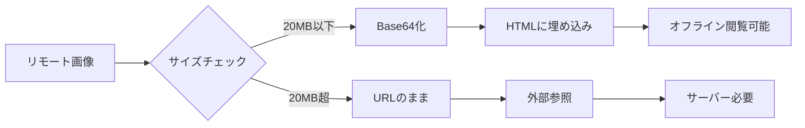
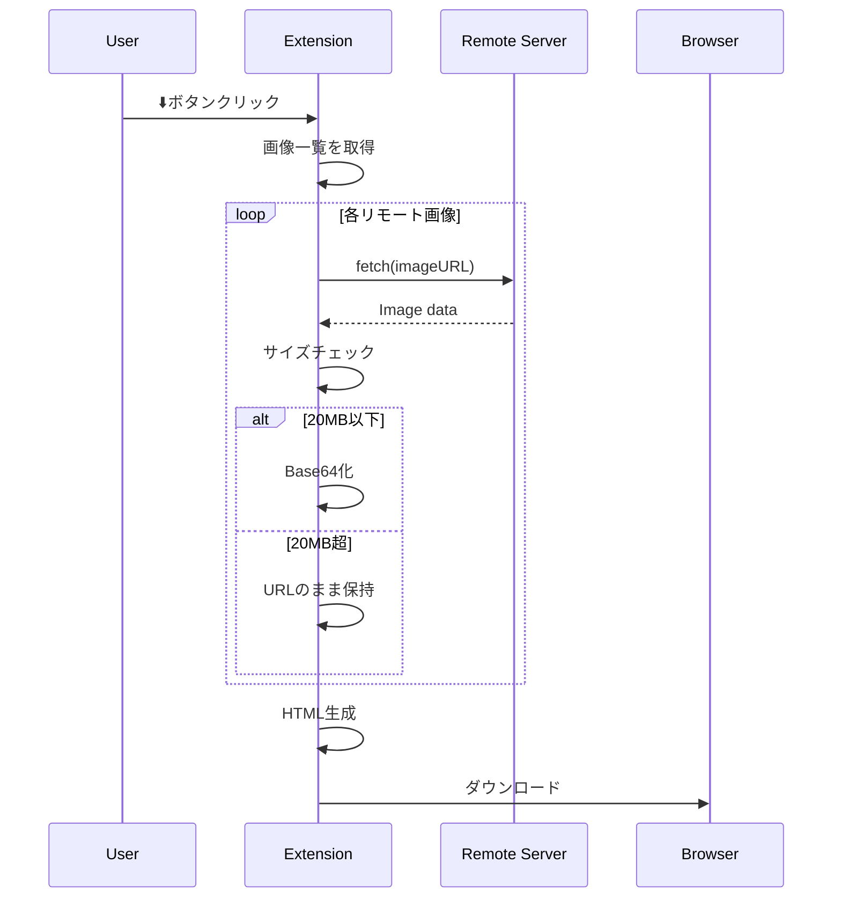

# リモート画像テスト

このファイルは、HTMLエクスポート機能のリモート画像埋め込みをテストするためのものです。

## テスト概要

- ローカル画像: 最大30MB/ファイル → Base64化
- リモート画像: 最大20MB/ファイル → Base64化（それ以上はURLのまま保持）

## 1. 小さいリモート画像（Base64化されるべき）

### 150x150の画像


### 300x200の画像


### 500x300の画像


## 2. GitHub上の画像

### GitHubロゴ（SVG）


### Octocat


## 3. 画像サイズの確認

エクスポート時に以下の処理が行われます：

1. **20MB以下のリモート画像**
   - fetchでダウンロード
   - MIMEタイプ検証（image/*のみ）
   - Base64に変換してHTMLに埋め込み
   - ✅ オフラインでも表示可能

2. **20MB超のリモート画像**
   - URLのまま保持
   - ⚠️ 画像サーバーが必要

3. **ローカル画像**
   - Background Service Workerで読み取り
   - 最大30MB/ファイル
   - Base64に変換してHTMLに埋め込み

## 4. Mermaidダイアグラムとの組み合わせ



## 5. 数式との組み合わせ

画像のサイズ制限は以下の式で表されます：

$$
\text{Base64化} = \begin{cases}
\text{Yes} & \text{if } \text{size} \leq 20\text{MB (remote)} \\
\text{Yes} & \text{if } \text{size} \leq 30\text{MB (local)} \\
\text{No} & \text{otherwise}
\end{cases}
$$

エクスポートされたHTMLのファイルサイズは：

$$
\text{HTML size} \approx \text{Base64 images} \times 1.33 + \text{other content}
$$

Base64エンコーディングは元のバイナリサイズの約133%になります。

## 6. 複数のリモート画像

### 異なるサイズの画像を並べる

| 小 | 中 | 大 |
|---|---|---|
|  |  |  |

## 7. テーブル内のリモート画像

| 種類 | サンプル | 説明 |
|------|---------|------|
| 画像1 |  | ランダム画像1 |
| 画像2 |  | ランダム画像2 |
| 画像3 |  | ランダム画像3 |

## 8. インライン画像

テキストの中に  小さな画像を埋め込むこともできます。この画像も  Base64化されます。

## 9. エクスポート時の処理フロー



## 10. コードブロックとの組み合わせ

```javascript
// リモート画像の処理例
async function convertRemoteImage(url) {
  const MAX_SIZE = 20 * 1024 * 1024; // 20MB

  const response = await fetch(url);
  const blob = await response.blob();

  if (blob.size > MAX_SIZE) {
    return url; // URLのまま
  }

  if (!blob.type.startsWith('image/')) {
    return url; // 画像以外
  }

  // Base64化
  const reader = new FileReader();
  return new Promise((resolve) => {
    reader.onload = () => resolve(reader.result);
    reader.readAsDataURL(blob);
  });
}
```

画像処理の結果例：


## まとめ

このファイルをエクスポートすると：

- ✅ すべての`picsum.photos`の画像がBase64化される（小さいため）
- ✅ GitHubの画像もBase64化される（サイズ制限内のため）
- ✅ Mermaidダイアグラムも保存される
- ✅ KaTeX数式も正しく表示される
- ✅ オフラインでも完全に閲覧可能

エクスポート後のHTMLは、インターネット接続がなくても画像を含めてすべて表示できます！

## 画像ソースについて

このテストファイルは以下の画像ソースを使用しています：

- **picsum.photos**: Lorem Picsumの無料画像サービス - ランダムな高品質画像
- **github.githubassets.com**: GitHub公式の画像アセット
