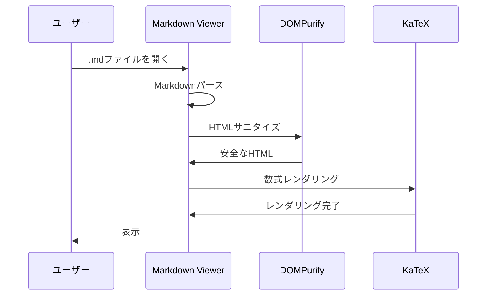

# セキュリティ＆機能テスト

このファイルは、Local Markdown Viewerのセキュリティと機能をテストするためのものです。

## 1. 数式レンダリングテスト（KaTeX v0.16.21）

### インライン数式
ピタゴラスの定理: $a^2 + b^2 = c^2$

アインシュタインの質量エネルギー等価性: $E = mc^2$

### ディスプレイ数式
$$
\int_{-\infty}^{\infty} e^{-x^2} dx = \sqrt{\pi}
$$

$$
\frac{-b \pm \sqrt{b^2 - 4ac}}{2a}
$$

### LaTeX形式
インライン: \(x = \frac{-b \pm \sqrt{b^2-4ac}}{2a}\)

ディスプレイ:
\[
\sum_{n=1}^{\infty} \frac{1}{n^2} = \frac{\pi^2}{6}
\]

### 価格表示（数式として誤認識されないテスト）
商品A: $10、商品B: $20、合計: $30

## 2. XSS防御テスト（DOMPurify v3.2.2）

### スクリプトタグの挿入テスト
<script>alert('XSS')</script>

### イベントハンドラーの挿入テスト


### JavaScript URLの挿入テスト
[悪意のあるリンク](javascript:alert('XSS'))

### HTML属性の挿入テスト
<div onclick="alert('XSS')">クリックしてください</div>

### SVG経由のXSS
<svg onload="alert('XSS')"></svg>

## 3. Markdownレンダリングテスト

### コードブロック
```javascript
function hello() {
  console.log("Hello, World!");
}
```

```python
def fibonacci(n):
    if n <= 1:
        return n
    return fibonacci(n-1) + fibonacci(n-2)
```

### テーブル
| ライブラリ | 旧バージョン | 新バージョン | 脆弱性 |
|----------|------------|------------|-------|
| DOMPurify | 3.0.8 | 3.2.2 | CVE-2024-45801 |
| KaTeX | 0.16.10 | 0.16.21 | CVE-2025-23207 |

### タスクリスト
- [x] DOMPurifyアップデート
- [x] KaTeXアップデート
- [ ] marked.jsアップデート（推奨）

### 引用
> セキュリティは、一度設定すれば終わりではなく、継続的なプロセスである。

### 画像


## 4. Mermaidダイアグラムテスト




## 5. 複雑な数式（KaTeX DoS対策テスト）

### マトリックス
$$
\begin{bmatrix}
1 & 2 & 3 \\
4 & 5 & 6 \\
7 & 8 & 9
\end{bmatrix}
$$

### 複雑な積分
$$
\oint_{\partial \Sigma} \mathbf{F} \cdot d\mathbf{r} = \iint_{\Sigma} (\nabla \times \mathbf{F}) \cdot d\mathbf{S}
$$

## ✅ テスト完了

上記の内容が正しく表示され、XSS攻撃が防御されていれば、アップデートは成功です！
